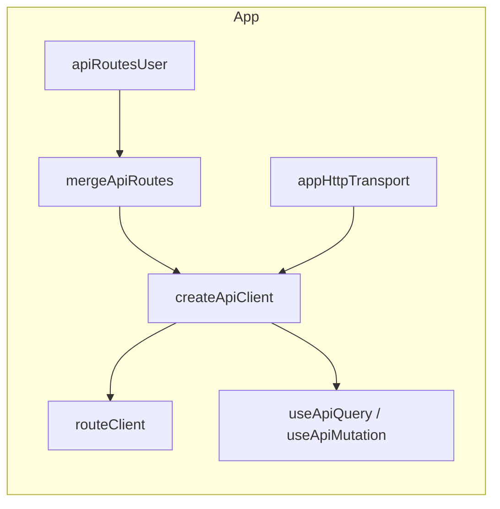

# useRequest — API tipada com Zod + TanStack Query

Biblioteca **copiável em camadas** para requisições REST em React com TypeScript: contrato de rotas + Zod, transporte HTTP plugável e hooks separados para query e mutation.

A lib **não** inclui adapter HTTP (fetch, axios, etc.). Você implementa o contrato `HttpTransport` no app. O core cuida de tipos, path params, validação Zod e chamadas.

---

## O que a lib oferece

| Módulo                   | Responsabilidade                                                           |
| ------------------------ | -------------------------------------------------------------------------- |
| `lib/core`               | Headless: rotas, `callRoute`, validação, erros de transporte               |
| `lib/react`              | Hooks `useApiQuery` / `useApiMutation` (TanStack Query v5)                 |
| `lib/create-api-client`  | Factory `createApiClient` → `ApiClient<R>` (cliente + hooks tipados)       |
| `services/api`           | Contrato do **seu** app (`defineApiRoutes` por domínio + `mergeApiRoutes`) |
| `libs/http-transport.ts` | **Exemplo** de transporte com `fetch` (não faz parte da lib)               |
| `api/client.ts`          | Bootstrap: `routeClient` + hooks com tipos explícitos                      |

### API principal (core)

| Função / tipo        | Uso                                                                 |
| -------------------- | ------------------------------------------------------------------- |
| `defineApiRoutes`    | Define um grupo de rotas preservando literais (`'/users/:id'`)      |
| `mergeApiRoutes`     | Une vários grupos sem perder inferência de paths                    |
| `createRouteClient`  | Cliente tipado (`callRoute`, `runCallRoute`, `routes`, `transport`) |
| `callRoute`          | GET implícito ou mutation com `{ method, params?, body? }`          |
| `runCallRoute`       | Mesma tipagem estrita; sempre exige `method` nas opções             |
| `executeCallRoute`   | Variante “loose” para runtime/testes internos                       |
| `HttpTransport`      | Contrato que você implementa (fetch, axios, ky, …)                  |
| `HttpTransportError` | Erro padronizado de rede / HTTP não-OK                              |

### API principal (react)

| Hook / tipo                                      | Uso                                                             |
| ------------------------------------------------ | --------------------------------------------------------------- |
| `createUseApiQuery` → `UseApiQueryHook<R>`       | Factory de GET; retorno tipado para export estável              |
| `createUseApiMutation` → `UseApiMutationHook<R>` | Factory de mutations; retorno tipado para export estável        |
| `createReactQueryHooks` → `ReactQueryHooks<R>`   | `{ useApiQuery, useApiMutation }` a partir do `routeClient`     |
| `createApiClient` → `ApiClient<R>`               | Atalho: `routeClient` + hooks com registry inferido de `routes` |
| `RouteRegistryFromClient<T>`                     | Extrai `R` de `typeof routeClient` (ou de `ApiClient`)          |

---

## Stack

| Camada            | Tecnologia                             |
| ----------------- | -------------------------------------- |
| HTTP              | `HttpTransport` (implementação no app) |
| Cache             | TanStack Query v5                      |
| Validação / tipos | Zod v4                                 |
| UI                | React 19                               |

---

## Arquitetura

```
src/
  lib/core/                # Headless (copiar para outro projeto)
  lib/react/               # Hooks TanStack (opcional)
  lib/create-api-client.ts # createApiClient + RouteRegistryFromClient
  services/api/            # Contrato apiRoutes do app
    users/                 # defineApiRoutes por domínio
    api-routes.ts          # mergeApiRoutes → apiRoutes
  libs/http-transport.ts   # Exemplo fetch (app)
  api/client.ts            # routeClient + hooks exportados
```



---

## Dependências

| Pacote                  | Função                                   |
| ----------------------- | ---------------------------------------- |
| `@tanstack/react-query` | Cache e estado assíncrono (camada react) |
| `zod`                   | Schemas e inferência de tipos nas rotas  |
| `react`                 | UI                                       |

Não há dependência de axios nem adapter HTTP na lib.

---

## Contrato de rotas

### Por domínio (`defineApiRoutes`)

Cada módulo importa `defineApiRoutes` **direto da lib** (evita dependência circular com `api-routes.ts`):

```ts
// services/api/users/api-routes-user.ts
import z from 'zod';
import { defineApiRoutes } from '../../../lib/core/define-api-routes';

export const apiRoutesUser = defineApiRoutes({
  '/users': {
    methods: {
      get: {
        responseSchema: z.array(
          z.object({
            id: z.number(),
            username: z.string(),
            email: z.string(),
            password: z.string(),
          }),
        ),
      },
    },
  },
  '/users/:userId': {
    methods: {
      put: {
        bodySchema: z.object({
          id: z.number(),
          username: z.string(),
          email: z.string(),
          password: z.string(),
        }),
      },
    },
  },
});
```

### Agregação (`mergeApiRoutes`)

Use `mergeApiRoutes` em vez de spread manual — preserva os **literais** das rotas para autocomplete no `routeClient`:

```ts
// services/api/api-routes.ts
import { mergeApiRoutes } from '../../lib/core/define-api-routes';
import { apiRoutesUser } from './users/api-routes-user';
// import { apiRoutesCursos } from './cursos/api-routes-cursos';

// Um grupo: retorna o tipo literal do grupo (sem alargar para Record<string, …>)
export const apiRoutes = mergeApiRoutes(apiRoutesUser);

// Vários grupos: interseção tipada (autocomplete de todos os paths)
// export const apiRoutes = mergeApiRoutes(apiRoutesUser, apiRoutesCursos);
```

Rotas duplicadas: o **último** grupo vence.

| Campo            | Uso                                                                 |
| ---------------- | ------------------------------------------------------------------- |
| `bodySchema`     | Body de POST/PUT/PATCH — tipagem (`z.input`) + validação em runtime |
| `responseSchema` | Resposta validada com Zod (`z.output`)                              |
| `errorSchema`    | Corpo de erro no `onError` do hook                                  |

**Schemas:** apenas Zod (`z.ZodType`). Outras libs de validação exigiriam adaptação do core.

---

## Transporte HTTP (`HttpTransport`)

Implemente no app (exemplo em `libs/http-transport.ts`):

```ts
import type {
  HttpTransport,
  HttpTransportRequest,
  HttpTransportResponse,
} from '../lib/core/http-transport';
import { HttpTransportError } from '../lib/core/http-transport';

export const appHttpTransport: HttpTransport = {
  async request(req: HttpTransportRequest): Promise<HttpTransportResponse> {
    // fetch, axios, ky, etc.
    // Em erro de rede ou status não-OK, lance HttpTransportError
    return { data: {}, status: 200 };
  },
};
```

---

## Bootstrap (`api/client.ts`)

Use `createApiClient` — o tipo do registry é inferido de `routes`; **não** precisa de `export type AppApiRoutes = typeof apiRoutes` em `api-routes.ts`.

`createApiClient` retorna `ApiClient<R>` com `routeClient`, `useApiQuery: UseApiQueryHook<R>` e `useApiMutation: UseApiMutationHook<R>`.

**Export recomendado:** evite desestruturar direto na exportação (`export const { … } = createApiClient(...)`). Com ESLint `strictTypeChecked`, isso pode fazer o TS resolver os hooks como tipo interno `error` e gerar `no-unsafe-assignment` no app. Exporte com tipos explícitos:

```ts
// api/client.ts
import {
  createApiClient,
  type RouteRegistryFromClient,
} from '../lib/create-api-client';
import type { UseApiMutationHook } from '../lib/react/use-api-mutation';
import type { UseApiQueryHook } from '../lib/react/use-api-query';
import { appHttpTransport } from '../libs/http-transport';
import { apiRoutes } from '../services/api/api-routes';

const apiClient = createApiClient({
  routes: apiRoutes,
  transport: appHttpTransport,
});

export const routeClient = apiClient.routeClient;

type AppRoutes = typeof apiRoutes;
// ou: RouteRegistryFromClient<typeof routeClient> | RouteRegistryFromClient<typeof apiClient>

export const useApiQuery: UseApiQueryHook<AppRoutes> = apiClient.useApiQuery;
export const useApiMutation: UseApiMutationHook<AppRoutes> =
  apiClient.useApiMutation;
```

Em outros arquivos, reutilize o registry assim:

```ts
import type { RouteRegistryFromClient } from '../lib/create-api-client';
import type { routeClient } from './api/client';

type AppRoutes = typeof apiRoutes;
// ou: RouteRegistryFromClient<typeof routeClient> | RouteRegistryFromClient<typeof apiClient>
```

Montagem manual (avançado): `createRouteClient` + `createReactQueryHooks(routeClient)` (retorna `ReactQueryHooks<R>`).

---

## Inferência de tipos (autocomplete)

Com `defineApiRoutes` + `mergeApiRoutes` + `createApiClient`:

- O **1º argumento** de `useApiQuery`, `useApiMutation`, `callRoute` e `runCallRoute` sugere apenas rotas cadastradas.
- Rotas com `:param` exigem `params` com chaves inferidas do path (`userId`, `id`, …).
- Métodos sem `bodySchema` não aceitam `body`; com `bodySchema`, `body` é **obrigatório** em `runCallRoute` / `callRoute` (mutation).
- `callRoute` sem opções só funciona em rotas com **GET** e sem `:param` no path.
- Rotas só com PUT/POST/etc. precisam de `callRoute('/rota', { method: 'put', ... })` ou `runCallRoute`.

Se o autocomplete não atualizar, rode **TypeScript: Restart TS Server** no editor.

Se aparecer `Unsafe assignment of an error typed value` em `useApiQuery` / `useApiMutation`, confira o padrão de export em `api/client.ts` (tipos `UseApiQueryHook<AppRoutes>` / `UseApiMutationHook<AppRoutes>`).

---

## Uso — React Query

### Query (GET implícito)

```tsx
const { data, isLoading } = useApiQuery('/users');

useApiQuery('/users', {
  enabled: false,
  queryKey: ['users'],
  queryParams: { page: 1 },
});

// Path com :param — params no hook; fetch só quando todos estiverem definidos
useApiQuery('/users/:userId', {
  params: { userId: 1 },
});
```

- `params` com valor `undefined` mantém a query **idle** (`enabled` automático).
- `enabled: false` desliga manualmente.

### Mutation

```tsx
const {
  mutate: updateUser,
  isPending,
  bodySchema,
} = useApiMutation('/users/:userId', { method: 'put' });

updateUser({
  params: { userId: 1 },
  body: {
    id: 1,
    username: 'ana',
    email: 'ana@example.com',
    password: 'secret',
  },
});

// params fixos no hook → mutate só com body
useApiMutation('/users/:userId', {
  method: 'put',
  params: { userId: 1 },
});
```

`bodySchema` no retorno do hook serve para integrar com react-hook-form + `@hookform/resolvers/zod`.

### Tabela `mutate` por cenário

| Rota                   | bodySchema | params no hook | `mutate(...)`                              |
| ---------------------- | ---------- | -------------- | ------------------------------------------ |
| `DELETE /cursos/:id`   | não        | não            | `mutate({ params: { id } })`               |
| `PUT /users/:id`       | sim        | não            | `mutate({ params: { id }, body })`         |
| `PUT /users/:id`       | sim        | `params` fixos | `mutate({ body })` ou override de `params` |
| `POST /items`          | sim        | não            | `mutate(body)` (sem `:param`)              |
| sem `:param`, sem body | não        | não            | `mutate()`                                 |

---

## Uso — sem TanStack (só HTTP)

### `callRoute`

```ts
// GET — rota com get e sem :param
const users = await routeClient.callRoute('/users');

// GET — rota com :param no path
const item = await routeClient.callRoute('/users/:userId', {
  params: { userId: 1 },
});

// PUT / POST / PATCH / DELETE — method obrigatório
const updated = await routeClient.callRoute('/users/:userId', {
  method: 'put',
  params: { userId: 1 },
  body: {
    id: 1,
    username: 'ana',
    email: 'ana@example.com',
    password: 'secret',
  },
});
```

### `runCallRoute`

Mesma tipagem estrita; `method` sempre nas opções (útil quando o TS deve inferir `params`/`body` sem ambiguidade de overloads do `callRoute`):

```ts
await routeClient.runCallRoute('/users/:userId', {
  method: 'put',
  params: { userId: 1 },
  body: {
    id: 1,
    username: 'ana',
    email: 'ana@example.com',
    password: 'secret',
  },
});
```

### Validação de params em runtime

Antes do HTTP, o core chama `assertRouteParamsReady`: se faltar algum param de rota (`:userId`, etc.), lança erro e **não** chama o transporte.

---

## Comportamentos importantes

1. **Path params** — substituídos na URL (`/users/1`); tipados a partir do literal do path.
2. **Body** — validado com `bodySchema.parse` antes do envio quando o schema existe.
3. **Response** — validada com `responseSchema` quando definido; senão retorna `unknown`.
4. **Erros HTTP** — transporte deve lançar `HttpTransportError`; hooks podem usar `errorSchema` no `onError`.
5. **mergeApiRoutes** — com um grupo, mantém o tipo literal; com N grupos, interseção tipada (paths não viram `string` genérico).
6. **Hooks exportados** — `createUseApiQuery` / `createUseApiMutation` declaram retorno `UseApiQueryHook<R>` / `UseApiMutationHook<R>`; em `api/client.ts`, anote os exports para o editor e o ESLint.
7. **Camada react opcional** — o core funciona sem TanStack; copie só `lib/core` se quiser.

---

## Migração do `useRequest` antigo

| Antes                                   | Depois                                            |
| --------------------------------------- | ------------------------------------------------- |
| `useRequest` único                      | `useApiQuery` + `useApiMutation`                  |
| `useApiQuery({ route, method: 'get' })` | `useApiQuery('/rota')`                            |
| `useApiMutation({ route, method })`     | `useApiMutation('/rota', { method })`             |
| `callRoute({ route, method, ... })`     | `callRoute('/rota', { method, ... })`             |
| `formSchema`                            | `bodySchema`                                      |
| `autoFetch`                             | `enabled` em `useApiQuery`                        |
| Adapter HTTP na lib                     | `HttpTransport` no app (`libs/http-transport.ts`) |
| `errorApiSchema`                        | `errorSchema`                                     |
| Spread de rotas                         | `mergeApiRoutes(grupoA, grupoB, ...)`             |

---

## Variáveis de ambiente

| Variável            | Descrição                                                   |
| ------------------- | ----------------------------------------------------------- |
| `VITE_API_BASE_URL` | URL base da API (usada no exemplo `libs/http-transport.ts`) |

---

## Scripts

```bash
pnpm dev
pnpm run build
pnpm run lint
pnpm lint:fix    # ESLint --fix + Prettier
pnpm test        # Jest (core + react)
pnpm test:watch
pnpm test:coverage
```

---

## Qualidade de código

- TypeScript `strict` + ESLint `strictTypeChecked`
- Sem `any` explícito
- Após alterar código: `pnpm lint:fix` → `pnpm test` → `pnpm run build`
