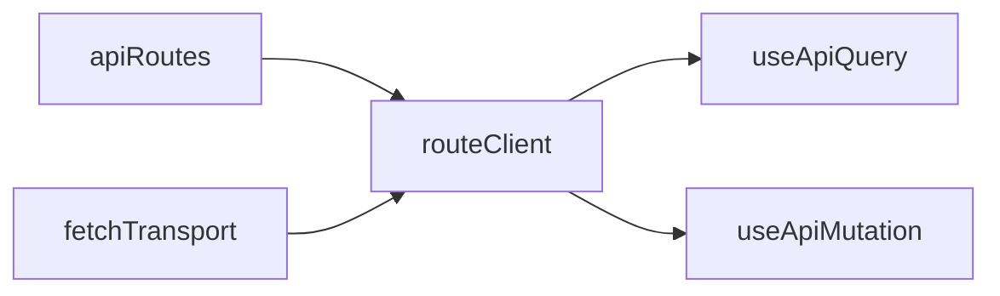

# useRequest — API tipada com fetch + TanStack Query

Biblioteca copiável em camadas para requisições REST em React com TypeScript: contrato de rotas + Zod, transporte HTTP plugável (fetch por padrão) e hooks separados para query e mutation.

---

## Stack padrão

| Camada            | Tecnologia                                          |
| ----------------- | --------------------------------------------------- |
| HTTP              | `fetch` nativo (`createFetchTransport`)             |
| Cache             | TanStack Query v5 (`useApiQuery`, `useApiMutation`) |
| Validação / tipos | Zod v4                                              |

---

## Arquitetura

```
src/
  lib/core/          # Headless: tipos, callRoute, fetch adapter
  lib/react/         # Hooks TanStack (opcional)
  api/client.ts      # Bootstrap do app (copiar/adaptar)
  services/api/      # Contrato apiRoutes + schemas Zod
  libs/fetch-config.ts
```



---

## Dependências

| Pacote                  | Função                        |
| ----------------------- | ----------------------------- |
| `@tanstack/react-query` | Cache e estado assíncrono     |
| `zod`                   | Schemas e inferência de tipos |
| `react`                 | UI                            |

Não há dependência de axios. O HTTP usa `fetch`; qualquer cliente pode ser plugado via `HttpTransport`.

---

## Contrato de rotas

```ts
export const apiRoutes = {
  '/solicitacao-motivos': {
    methods: {
      get: { responseSchema: getSolicitacaoMotivoSchema },
    },
  },
  '/solicitacao/alterar-unidade-consumidora/:id': {
    methods: {
      patch: { bodySchema: updateUnidadeConsumidoraSchema },
    },
  },
  '/cursos/:id': {
    methods: {
      delete: {},
    },
  },
} as const;
```

| Campo            | Uso                                             |
| ---------------- | ----------------------------------------------- |
| `bodySchema`     | Payload de POST/PUT/PATCH (tipagem + validação) |
| `responseSchema` | Resposta validada com Zod                       |
| `errorSchema`    | Corpo de erro da API no `onError`               |

---

## Bootstrap (`api/client.ts`)

```ts
import { createFetchTransport } from '../lib/core/adapters/fetch-transport';
import { createRouteClient } from '../lib/core/call-route';
import { createReactQueryHooks } from '../lib/react/create-react-query-hooks';
import { fetchConfig } from '../libs/fetch-config';
import { apiRoutes } from '../services/api/api-routes';

export const routeClient = createRouteClient({
  routes: apiRoutes,
  transport: createFetchTransport(fetchConfig),
});

export const { useApiQuery, useApiMutation } =
  createReactQueryHooks(routeClient);
```

---

## Uso

### Query (GET implícito)

A rota é o primeiro argumento; o método é sempre `get`.

```tsx
const { data, isLoading, refetch } = useApiQuery('/solicitacao-motivos');

useApiQuery('/solicitacao-motivos', {
  enabled: false,
  queryKey: ['motivos'],
});

// URL com :param — segundo argumento obrigatório com params
useApiQuery('/endereco/:id', { params: { id: 42 } });
```

### Mutation

O método vai no segundo argumento (obrigatório). `params` no hook fixam o id na URL; caso contrário, o `mutate` recebe params (e body quando houver schema).

```tsx
// params fixos no hook → mutate só recebe o body
const { mutate: updateUnidade } = useApiMutation(
  '/solicitacao/alterar-unidade-consumidora/:id',
  { method: 'patch', params: { id: '123' } },
);
updateUnidade({ unidade_consumidora: '10/12345678' });

// id dinâmico no mutate (DELETE, PATCH, PUT, etc.)
const { mutate: deleteCurso } = useApiMutation('/cursos/:id', {
  method: 'delete',
});
deleteCurso('42');
deleteCurso({ id: '42' });
```

`bodySchema` no retorno do hook pode ser usado com react-hook-form + `@hookform/resolvers/zod`.

### Argumentos de `mutate` por cenário

| Rota                   | bodySchema | params no hook        | `mutate(...)`                                                   |
| ---------------------- | ---------- | --------------------- | --------------------------------------------------------------- |
| `DELETE /cursos/:id`   | não        | não                   | `mutate(curso.id)` ou `mutate({ id })`                          |
| `PATCH /cursos/:id`    | sim        | não                   | `mutate({ id, ...body })` ou `mutate({ params: { id }, body })` |
| `PATCH /foo/:id`       | sim        | `params: { id }` fixo | `mutate(body)` apenas                                           |
| `POST /items`          | sim        | não                   | `mutate(body)`                                                  |
| sem `:param`, sem body | não        | não                   | `mutate()`                                                      |

Regra: se `params` estão no hook, o `mutate` só recebe o **body**; se não estão, o `mutate` recebe **params** (e body quando houver `bodySchema`).

### Uso em laço (id dinâmico)

Declare o hook **uma vez** fora do laço; chame `mutate` dentro com o id de cada item:

```tsx
const { mutate: deleteCurso } = useApiMutation('/cursos/:id', {
  method: 'delete',
});

cursos.forEach((curso) => {
  deleteCurso(curso.id);
});

const { mutate: patchCurso } = useApiMutation('/cursos/:id', {
  method: 'patch',
});

itens.forEach((item) => {
  patchCurso({ id: item.id, ativo: true });
  // equivalente: patchCurso({ params: { id: item.id }, body: { ativo: true } })
});
```

### Sem TanStack (só HTTP)

```ts
const data = await routeClient.callRoute({
  route: '/solicitacao-motivos',
  method: 'get',
});
```

### TanStack manual

```tsx
const mutation = useMutation({
  mutationFn: (body) =>
    routeClient.callRoute({
      route: '/solicitacao/alterar-unidade-consumidora/:id',
      method: 'patch',
      params: { id: '123' },
      body,
    }),
});
```

---

## Transporte customizado

Implemente `HttpTransport`:

```ts
import type { HttpTransport } from './lib/core/http-transport';

const myTransport: HttpTransport = {
  async request(req) {
    // axios, ky, etc.
    return { data: {}, status: 200 };
  },
};

export const routeClient = createRouteClient({
  routes: apiRoutes,
  transport: myTransport,
});
```

---

## Migração do `useRequest` antigo

| Antes                                   | Depois                                       |
| --------------------------------------- | -------------------------------------------- |
| `useRequest` único                      | `useApiQuery` + `useApiMutation`             |
| `useApiQuery({ route, method: 'get' })` | `useApiQuery('/rota')`                       |
| `useApiMutation({ route, method })`     | `useApiMutation('/rota', { method })`        |
| `formSchema`                            | `bodySchema`                                 |
| `autoFetch`                             | `enabled` em `useApiQuery`                   |
| axios                                   | `createFetchTransport` ou transporte próprio |
| `errorApiSchema`                        | `errorSchema`                                |

---

## Variáveis de ambiente

| Variável        | Descrição       |
| --------------- | --------------- |
| `VITE_BASE_URL` | URL base da API |

---

## Scripts

```bash
pnpm dev
pnpm run build
pnpm run lint
pnpm lint:fix   # ESLint --fix + Prettier
```

---

## Qualidade de código

- TypeScript `strict`
- ESLint `strictTypeChecked` (sem `any` explícito)
- Após editar código, rode `pnpm lint:fix` e corrija erros/warnings
